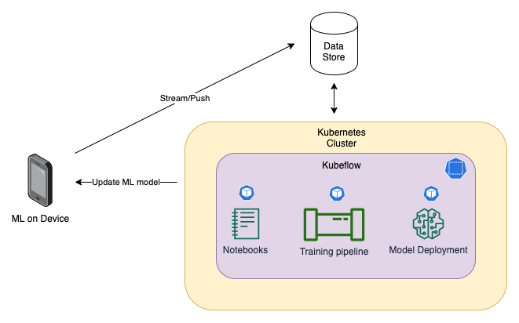

# Smart movement

## Based on my article in JavaSpektrum 05/2020: Kubernetes - Smarte Orchestrierung von Docker & Co. (25.09.2020)

This example project will cover a Smartphone extension to track movement data and process the Machine Learning pipeline
on Kubernetes using Kubeflow.

The goal is to design a blueprint for a scaleable Mobile data and Machine Learning pipeline to capture data and build
smart recommendations features.

__Focus__
* Scalable capture and processing of mobile data in a Kubernetes setup
* On premise or cloud data processing
* Fully automated Machine Learning pipeline to process mobile data

__Used Frameworks__
1. Flutter for the mobile application with different sensor packages
2. Kubeflow on Kubernetes
3. SciKitLearn

## Simplified architecture:

## Content of this repository
* Flutter app to track user movement data and OnDevice Machine Learning with TFLite
* Machine Learning Jupyter Notebooks for Feature Engineering and Machine Learning models
* Kubeflow pipelines for automatic model processing
* KFServing YAML files for Model serving
* KFServing templates for Canary rollouts

